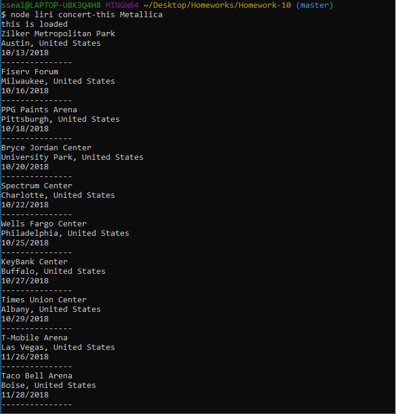
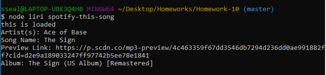
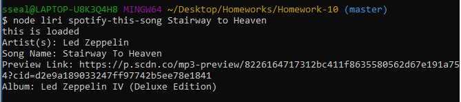
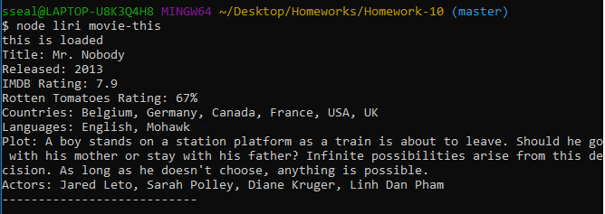
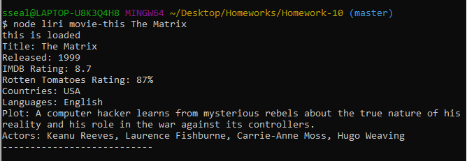
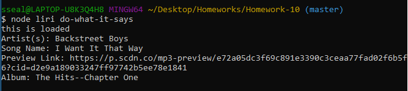

# liri-node-app
## What this project does
This app functions as a Language Interpretation and Recognition Interface (or LIRI).  It is a command line node app that returns data to the user based on the parameters that are provided.
## Why the project is useful
LIRI provides the user with a quick way to search for song data through Spotify, movie data through OMDB, or concert data through Bands in Town.
## How users can get started with the project
By typing "node liri" into the command line along with a command and search term, Liri will respond with a concise list of response data about the search term.  The possible commands are "concert-this", "spotify-this-song", "movie-this", and "do-what-it-says".  Concert-this will search Bands in Town for a list of venue names, locations, and dates.  Spotify-this-song will return the artists, name, Spotify preview link, and album of a song (the default is "The Sign" by Ace of Base if no search term is provided).  Movie-this will display the title, release year, imdb rating, rotten tomatoes rating, production country, language, plot and actors of a movie (the default is "Mr. Nobody" if no search term is provided).  Do-what-it-says will read the text within the file random.txt and run the command that is saved within it.  For more details, please see below.
## Where users can get help with this project
If there are issues or questions with this project, feel free to contact me at nniesel90@gmail.com
## Who maintains and contributes to this project
Currently, all work on this project has been done by Nathan Niesel.
## Examples of the App Functioning

